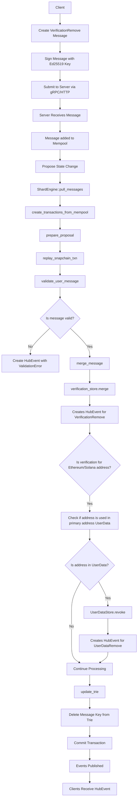

```mermaid
flowchart TD
    A[Client] --> B[Create VerificationRemove Message]
    B --> C[Sign Message with Ed25519 Key]
    C --> D[Submit to Server via gRPC/HTTP]
    
    D --> E[Server Receives Message]
    E --> F[Message added to Mempool]
    F --> G[Propose State Change]
    
    G --> H[ShardEngine::pull_messages]
    H --> I[create_transactions_from_mempool]
    I --> J[prepare_proposal]
    
    J --> K[replay_snapchain_txn]
    K --> L[validate_user_message]
    L --> M{Is message valid?}
    
    M -->|No| N[Create HubEvent with ValidationError]
    M -->|Yes| O[merge_message]
    
    O --> P[verification_store.merge]
    P --> Q[Creates HubEvent for VerificationRemove]
    
    Q --> R{Is verification for Ethereum/Solana address?}
    R -->|Yes| S[Check if address is used in primary address UserData]
    S --> T{Is address in UserData?}
    
    T -->|No| V[Continue Processing]
    T -->|Yes| U[UserDataStore.revoke]
    U --> U1[Creates HubEvent for UserDataRemove]
    U1 --> V
    
    V --> W[update_trie]
    W --> X[Delete Message Key from Trie]
    X --> Y[Commit Transaction]
    
    Y --> Z[Events Published]
    Z --> AA[Clients Receive HubEvent]
```