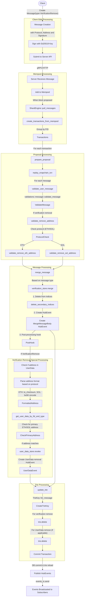

```mermaid
flowchart TD
    %% Client Side
    Client([Client]) --> |"Create Message(type=VerificationRemove)"|ClientMsg

    subgraph ClientSide["Client-Side Processing"]
        ClientMsg[Message Creation] --> |"with Protocol, Address and Signature"|Sign
        Sign[Sign with Ed25519 Key] --> Submit
        Submit[Submit to Server API]
    end

    %% Server Side Initial Processing
    Submit --> |"gRPC/HTTP"|ServerRecv[Server Receives Message]
    
    subgraph MempoolProcessing["Mempool Processing"]
        ServerRecv --> Mempool[Add to Mempool]
        Mempool --> |"When block proposed"|PullMessages
        PullMessages[ShardEngine::pull_messages] --> CreateTxs
        CreateTxs[create_transactions_from_mempool] --> |"Group by FID"|Transactions
    end

    %% Transaction Processing
    Transactions --> |"For each transaction"|ProposeStateChange

    subgraph ProposalProcessing["Proposal Processing"]
        ProposeStateChange[prepare_proposal] --> ReplayTxn
        ReplayTxn[replay_snapchain_txn] --> |"For each message"|ValidateUserMsg
        ValidateUserMsg[validate_user_message] --> |"validations::message::validate_message"|ValidateMessage
        ValidateMessage --> |"If verification removal"|ValidateRemoveAddr
        ValidateRemoveAddr[validate_remove_address] --> |"Check protocol (ETH/SOL)"|ProtocolCheck
        ProtocolCheck --> |"ETH"|ValidateETHAddr[validate_remove_eth_address]
        ProtocolCheck --> |"SOL"|ValidateSOLAddr[validate_remove_sol_address]
    end

    %% Message Merging
    ValidateETHAddr --> MergeMessage
    ValidateSOLAddr --> MergeMessage
    
    subgraph MessageProcessing["Message Processing"]
        MergeMessage[merge_message] --> |"Based on message type"|VerificationStore
        VerificationStore[verification_store.merge] --> |"1. Delete from indices"|DeleteIndices
        DeleteIndices[delete_secondary_indices] --> |"2. Create HubEvent"|CreateEvent
        CreateEvent[Create MergeMessageBody HubEvent] --> |"3. Post-processing hook"|PostHook
    end

    %% Special Post Hook for Verification Removal
    PostHook --> |"If VerificationRemove"|VerificationHook
    
    subgraph VerificationRemovalHook["Verification Removal Special Processing"]
        VerificationHook[Check if address in UserData] --> ParseAddress
        ParseAddress[Parse address format based on protocol] --> |"ETH: to_checksum, SOL: bs58::encode"|FormattedAddress
        FormattedAddress --> GetUserData
        GetUserData[get_user_data_by_fid_and_type] --> |"Check for primary ETH/SOL address"|CheckPrimaryAddress
        CheckPrimaryAddress --> |"If address matches"|RevokePrimary
        RevokePrimary[user_data_store.revoke] --> |"Create UserData removal HubEvent"|UserDataEvent
    end

    %% Trie Updates
    UserDataEvent --> UpdateTrie
    CreateEvent --> UpdateTrie
    
    subgraph TrieProcessing["Trie Processing"]
        UpdateTrie[update_trie] --> |"TrieKey::for_message"|CreateTrieKey
        CreateTrieKey --> |"For verification remove"|DeleteFromTrie
        DeleteFromTrie[trie.delete] --> |"For UserData remove (if applicable)"|DeleteUserDataFromTrie
        DeleteUserDataFromTrie[trie.delete] --> CommitTxn
    end

    %% Committing & Publishing
    CommitTxn[Commit Transaction] --> |"DB commit & trie reload"|PublishEvents
    PublishEvents[Publish HubEvents] --> |"events_tx.send"|Broadcasted
    Broadcasted[Events Broadcasted to Subscribers]
```